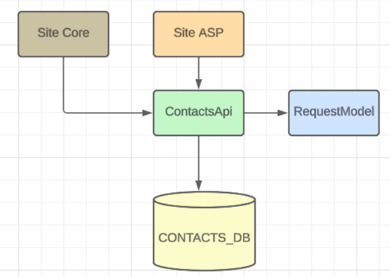

# Contacts Web Site

## Deployed Artifacts & Status
The following functionality was implemented in API and web sites
- Register & Login - https://siteasp-mgg.azurewebsites.net/ 
- CRUD operations: Create, List, Edit, Delete Contacts - https://sitecore-mgg.azurewebsites.net/ 
- Unit tests were written for the API

## User Documentation

## Architecture

There is MSSQL database with two tables: `USERS` and `CONTACTS`, that have a relationship

The only way reach the database is through the `ContactsApi` layer

`RequestModel` contains the models that are used to make requests and receive results from the `ContactsApi`, 
therefore is used also in the `Site Core` and `Site Asp`

## Source Code

- Contacts Api Source Code 
- Site ASP Source Code
- Site Code Source Code

## Token & Session sharing

The idea was to create a token when user logged into the ASP side, and bind it to the userId, and store it on the database using the ContactsApi, then to redirect to the Site Core using that token to retrieve the userId and know the contacts to show.

Once the logout happens the token will be expired/removed and will be redirected to the Site ASP to login/register

## Other improvements

The `RequestModel` should be a shared library that is deployed and reference by other projects

The API should have some security to avoid unauthorized requests

The implemented session mecachism should expire the session

The Delete contact should have a confirmation dialog to avoid accidental deletes
